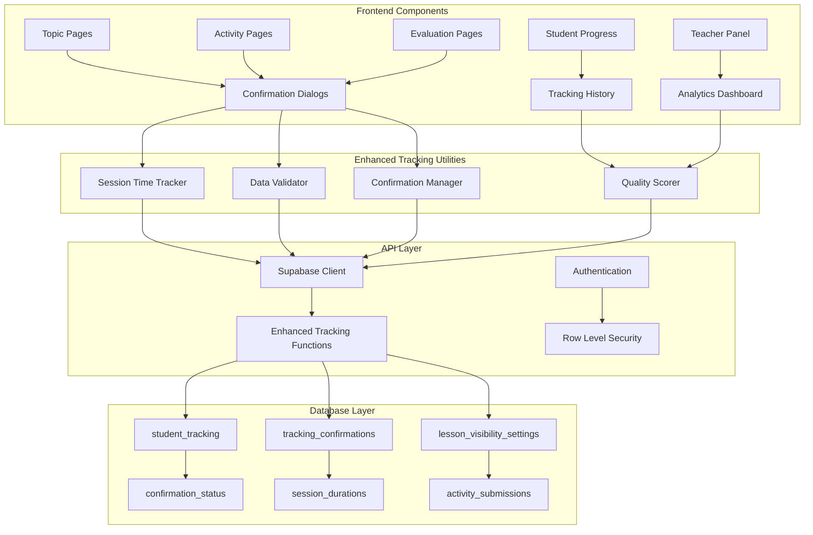
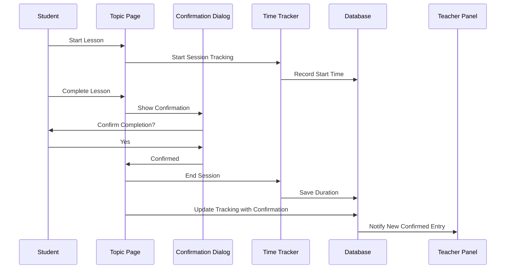
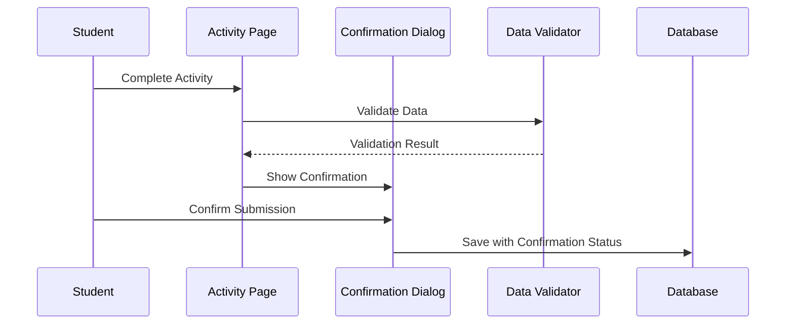
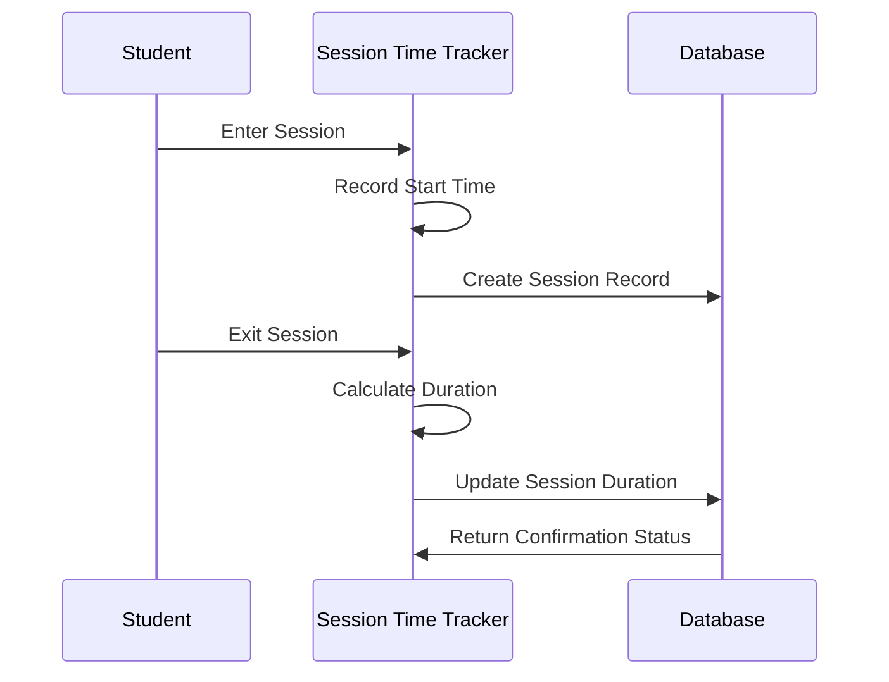
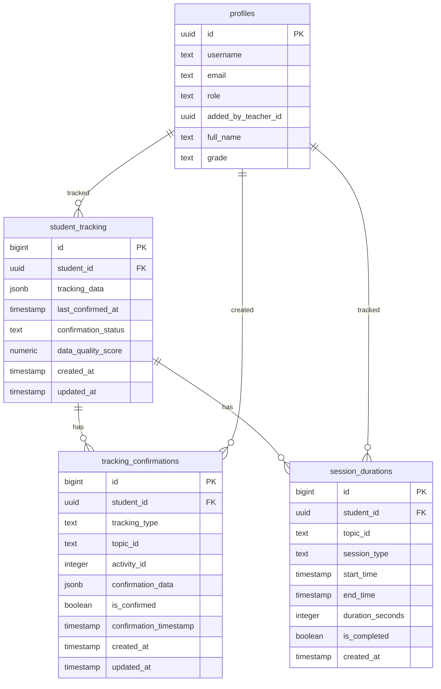

# Enhanced Student Tracking System Architecture

## System Overview



## Data Flow Architecture

### 1. Lesson Completion Flow



### 2. Activity Submission Flow



### 3. Time Tracking Flow



## Database Schema Relationships



## Component Architecture

### Frontend Components

```
src/
├── components/
│   ├── ConfirmationDialog.tsx          # Base confirmation dialog
│   ├── LessonCompletionConfirmation.tsx  # Lesson-specific confirmation
│   ├── ActivitySubmissionConfirmation.tsx # Activity-specific confirmation
│   ├── EvaluationSubmissionConfirmation.tsx # Evaluation-specific confirmation
│   └── TimeTrackerDisplay.tsx         # Session duration display
├── utils/
│   ├── enhancedStudentTracking.ts     # Enhanced tracking functions
│   ├── sessionTimeTracker.ts          # Time tracking utilities
│   ├── dataValidator.ts               # Data validation functions
│   └── qualityScorer.ts               # Data quality scoring
└── pages/
    ├── topic.tsx                     # Enhanced with confirmation
    ├── Activity.tsx                   # Enhanced with confirmation
    ├── Evaluate.tsx                   # Enhanced with confirmation
    └── StudentProgress.tsx           # Enhanced with tracking history
```

### Backend Database Structure

```sql
-- Enhanced student tracking table
student_tracking
├── id (primary key)
├── student_id (foreign key to profiles)
├── tracking_data (jsonb)
├── last_confirmed_at (timestamp)
├── confirmation_status ('pending', 'confirmed', 'rejected')
├── data_quality_score (0-100)
├── created_at
└── updated_at

-- Tracking confirmations table
tracking_confirmations
├── id (primary key)
├── student_id (foreign key)
├── tracking_type ('lesson', 'activity', 'evaluation', 'collaborative')
├── topic_id
├── activity_id (nullable)
├── confirmation_data (jsonb)
├── is_confirmed (boolean)
├── confirmation_timestamp (nullable)
├── created_at
└── updated_at

-- Session durations table
session_durations
├── id (primary key)
├── student_id (foreign key)
├── topic_id
├── session_type ('lesson', 'review', 'evaluation', 'activity', 'collaborative')
├── start_time
├── end_time (nullable)
├── duration_seconds (nullable)
├── is_completed (boolean)
└── created_at
```

## Security and Permissions

### Row Level Security Policies

```sql
-- Students can view their own tracking data
CREATE POLICY "Students can view own tracking" ON student_tracking
    FOR SELECT USING (auth.uid() = student_id);

-- Students can confirm their own tracking entries
CREATE POLICY "Students can confirm own tracking" ON tracking_confirmations
    FOR UPDATE USING (auth.uid() = student_id);

-- Teachers can view tracking for their students
CREATE POLICY "Teachers can view student tracking" ON student_tracking
    FOR SELECT USING (
        EXISTS (
            SELECT 1 FROM profiles p
            WHERE p.id = auth.uid() 
            AND p.role IN ('teacher', 'admin')
            AND (
                p.role = 'admin' 
                OR EXISTS (
                    SELECT 1 FROM profiles s
                    WHERE s.id = student_tracking.student_id 
                    AND s.added_by_teacher_id = auth.uid()
                )
            )
        )
    );
```

## Performance Considerations

### Indexing Strategy

```sql
-- Indexes for fast queries
CREATE INDEX idx_student_tracking_student_status 
ON student_tracking (student_id, confirmation_status);

CREATE INDEX idx_tracking_confirmations_student_topic 
ON tracking_confirmations (student_id, topic_id, tracking_type);

CREATE INDEX idx_session_durations_student_session 
ON session_durations (student_id, session_type, start_time);

-- Composite indexes for analytics
CREATE INDEX idx_tracking_analytics 
ON student_tracking (confirmation_status, last_confirmed_at);

CREATE INDEX idx_session_analytics 
ON session_durations (student_id, session_type, duration_seconds);
```

### Caching Strategy

1. **Student Tracking Cache**: Cache individual student tracking data
2. **Session Duration Cache**: Cache active session durations
3. **Confirmation Status Cache**: Cache confirmation status for quick UI updates
4. **Quality Score Cache**: Cache calculated quality scores

## Monitoring and Analytics

### Key Metrics to Track

1. **Confirmation Rate**: Percentage of tracking entries that are confirmed
2. **Data Quality Score**: Average quality score across all tracking entries
3. **Session Duration**: Average time spent in different session types
4. **Validation Failure Rate**: Percentage of tracking entries that fail validation
5. **User Response Time**: Average time to complete confirmation dialogs

### Dashboard Components


This architecture provides a comprehensive foundation for an enhanced student tracking system with proper confirmation mechanisms, time tracking, and data validation capabilities.